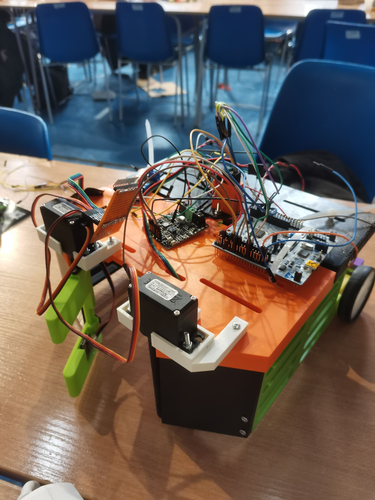
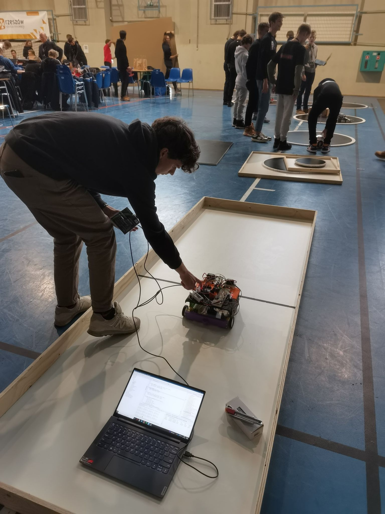
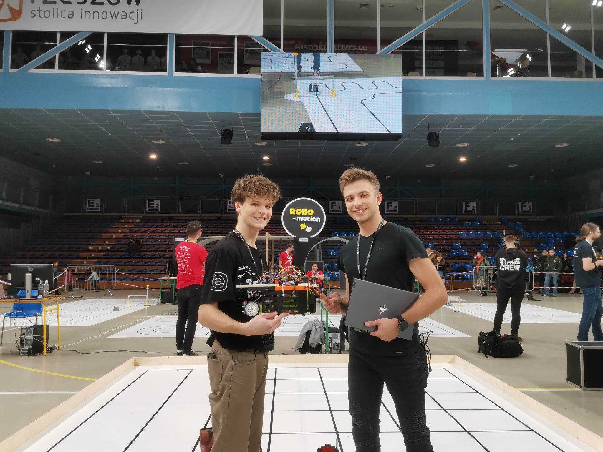

# 🤖 Karczownik Robot Software

## 📝 Description

In this repository there is a software for our "Karczownik" Robot, which was created for xChallenge competitions in 2022. The category was "Onion House" - the target was to get through the grid, collect onions, leave other objects and return to the starting point.

## 📚 Technologies and microcontroller

-   as a microcontroller we used STM32F4
-   we used HAL library for STM32F4
-   whole software was written in C

## 🤓 What I've learned

It has been definitely one of the most complex and developing projects I've been working on. For the first time we built a robot from scratch - from idea, through design, to implementation. I've learned a lot about electronics, 3D design, microcontrollers and C programming. I've also learned how to work in a team and how to divide tasks between team members.

It has been really meaningful experience, and surely we've learnt from our mistakes (and there were a lot of them). I'm really proud of what we've achieved and I'm looking forward to the next edition of xChallenge.

## 📷 Pictures

  
